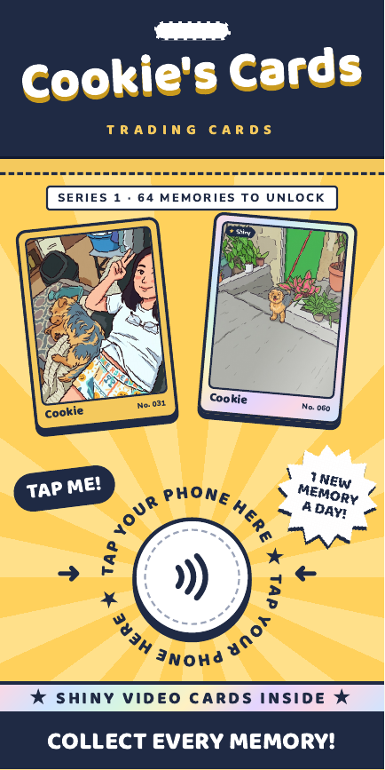
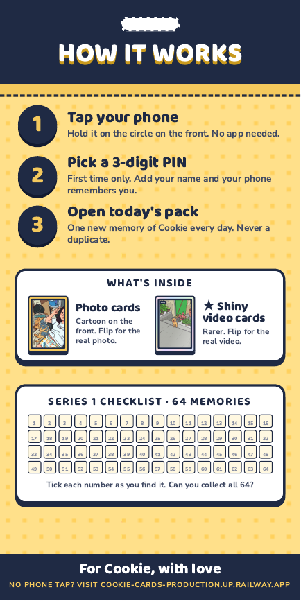

# Cookie's Cards

One memory of Cookie a day, opened by tapping an NFC tag.

- Each person sets a 3-digit PIN and a name once; the phone then remembers them.
- Each person gets one random card per day (Manila time), never a duplicate, until every card is found.
- Photos become cards with a cartoon front and the real photo on the back. Videos become shiny cards with the real video on the back.
- `/admin` is where memories are uploaded, given a cartoon version and a title by Gemini, reviewed and published.

## Run it on Railway

1. **New project → Deploy from GitHub repo** and pick this repo. Railway detects Node and runs `npm start`.
2. **Add a PostgreSQL database** to the project, then on the app service add the variable `DATABASE_URL` referencing the database's `DATABASE_URL`.
3. **Add a volume** to the app service, mounted at `/data`. This keeps the photos and videos across deploys.
4. **Set these variables** on the app service:

   | Variable | Value |
   | --- | --- |
   | `MEDIA_DIR` | `/data` |
   | `ADMIN_PASSWORD` | a long password only you know |
   | `GEMINI_API_KEY` | your Gemini API key (see below) |

   Optional: `APP_TIMEZONE` (default `Asia/Manila`), `GEMINI_IMAGE_MODEL` (default `gemini-3.1-flash-image`), `GEMINI_TEXT_MODEL` (default `gemini-3.8-flash`).
5. **Generate a domain** under the service's Settings → Networking. That address is what the NFC tag points to.

## Getting the Gemini API key

1. Open Google AI Studio (aistudio.google.com) signed in with the Google account that owns your GCP project.
2. Choose **Get API key → Create API key** and select your GCP project.
3. Image generation needs billing enabled on that project.
4. Paste the key into Railway as `GEMINI_API_KEY`. Never put it in the code or the repo.

## Adding memories

Open `https://<your-domain>/admin`, sign in with `ADMIN_PASSWORD`, and upload photos and videos. Each one is drawn as a cartoon and titled, then waits as a draft. Edit the title or date, ask for a new cartoon if you don't like it, and press **Publish** to put it in the pool.

Videos: MP4 (H.264) plays on every phone. Upload from a browser that can play the file, because the cartoon is drawn from a still frame taken in the browser.

## Writing the NFC tag

Use any NFC writer app (for example "NFC Tools"), choose **Write → Add a record → URL**, enter `https://<your-domain>/`, and hold the tag to the phone. NTAG213/215 stickers work with both iPhone and Android.

## Run locally

```
npm install
DATABASE_URL=postgres://localhost/ctc ADMIN_PASSWORD=dev npm start
```

## Reference materials

| File | What it is |
| --- | --- |
| [`docs/cookies-cards-ad-v2.mp4`](docs/cookies-cards-ad-v2.mp4) | The 30-second intro video, original quality (1080×1920). The app plays a smaller copy of it, `public/intro.mp4`, on the landing page. |
| [`docs/cookie-card-print.pdf`](docs/cookie-card-print.pdf) | The printable two-sided card that carries the NFC sticker (about 100 × 200 mm). |

| Front | Back |
| --- | --- |
|  |  |

**Printed card.** The front marks where the NFC sticker goes ("Tap your phone here"). The back explains the three steps, the two card types, and has a 64-box checklist for Series 1. The footer prints the app's address for phones without NFC, so reprint the card if the domain ever changes.

**Replacing the intro video.** Put the new original in `docs/`, then make the web copy and its poster frame:

```
ffmpeg -i docs/NEW.mp4 -vf scale=720:-2 -c:v libx264 -crf 25 -preset slow -pix_fmt yuv420p -c:a aac -b:a 112k -movflags +faststart public/intro.mp4
ffmpeg -ss 9 -i public/intro.mp4 -frames:v 1 -q:v 4 public/intro.jpg
```
